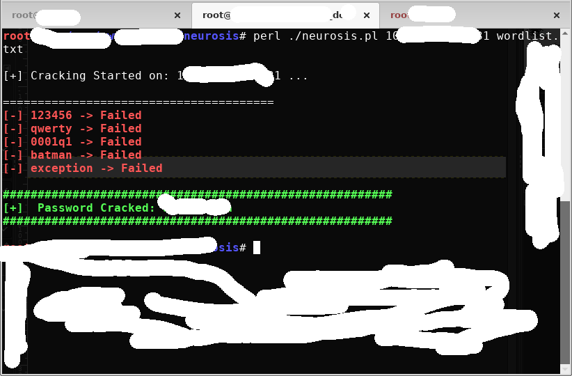

<h2>  Neurosis  is a brute force program for find facebook passwords </h2>   

  <table>
  
   <tr>
     <td>  </td>
  <td> System requirements (quad core and more, 4gb ram and more) </td>
   </tr>
   
  <tr>
   <td>  </td>
   <td>  OS System: (Gnu/linux systems bellow) </td>
  </tr>
 
 <tr>
  <td> RPM-based (Red Hat Linux, CentOS, Fedora, openSUSE, Mandrake Linux etc) </td>     
  <td>    </td>   
</tr>
  
 <tr>
  <td> Debian-based </td>
  <td>  </td>
 </tr>
     
 <tr>    
  <td> MEPIS-based </td> 
  <td>  </td> 
</tr>

<tr>
 <td> Gentoo-based </td>
  <td>  </td>
</tr>
     
<tr>     
  <td> Slackware-based </td>
  <td>  </td>      
</tr>

</table>

1) How to use neurosis   
   i) download the project  
   ii) extract to folder and chmod 777 all files e.x chmod -R 777 /root/neurosis  
   iii) go path to folder e.x /root/neurosis  
   iv) run the neurosis script (insert id or email to vitcim and select a wordlist)  
       e.x perl ./neurosis facebook@gmail.com wordlist.txt  
       
2) Note for wordlists
   
    If the available lists do not serve you then you can make some of your own with the crunch program 
    
  
  if you find the password you will see it in green letters  
  
   
  
